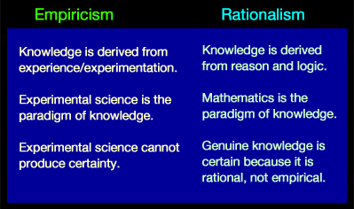
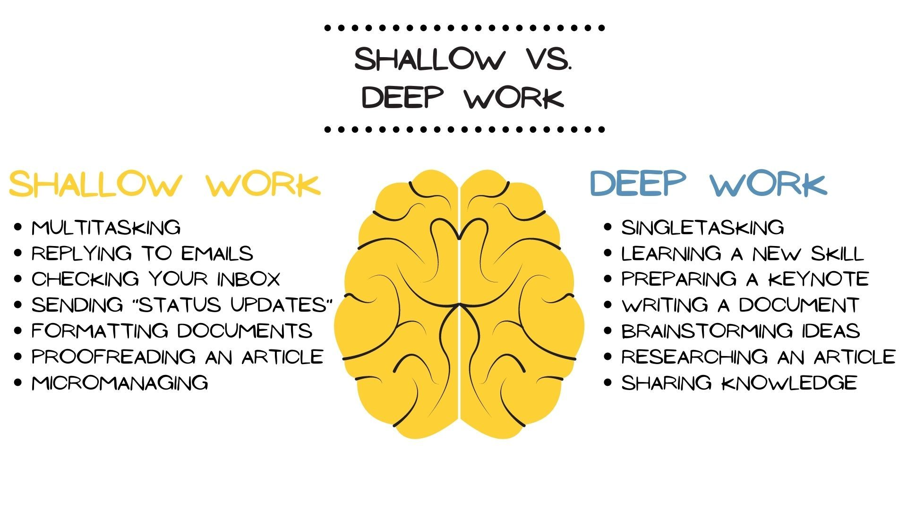
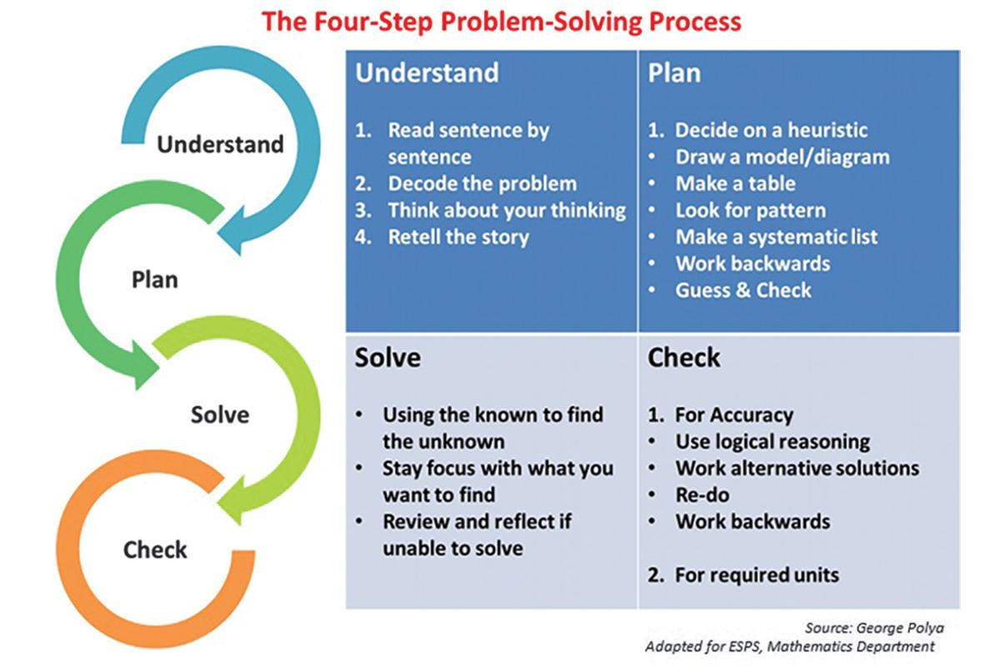

# STEP session 1
## Epistemology, Learning Pedagogy, and Problem Solving
This session is an introductory session that is meant to give you some of the most important fundamentals that any scientist, mathematician, and engineer SHOULD know but often times do not know. Although one need not know some of these concepts in order to do interesting work in the quantatative realm, having a robust theory of knowledge, an evidence based learning strategy, and a systematic approach to problem solving can help streamline any quantatative endeavor. Moreover, knowledge of these fundamentals helps one accuractely communicate their work to broad audiences and provide insight on potential shortcomings or extensions of an idea/project. 

### Epistemology
Epistemology is a branch of philosophy concerned with knowledge. Historically, many figures can be crudely classified as rationalist or empiricists. The rationalists, epitomized by Plato, are the folks that try to reason things from first principles. Rationalist are known for devising clever theories and framing problems in interesting ways that lend themselves to abstract methods of analysis. On the other hand, rationalists like to make observations and generate descriptions based on the results of the observations. The quintessential empiricist is Aristotle, and empiricists are known to devise clever experiments in order to make interesting observations.

Epistemology is chiefly concerned with identifying whether a problem is physical or metaphysical. A physical problem is one that can be reduced to a series of statements that can either be true or false. For example, a physical statement might be "the temperature at the end of the rod of steel is 70 degrees Fahrenheit after being stored in a container at room temperature for a month". One can readily devise an experiment so that we can observe whether or not this is the case. A metaphysical statement on the other hand is neither true nor false. A popular example might be "The foreign policy of [insert country] is overall a global force for good". Although one may still construct compelling arguments for why a particular country is or is not a global force for good, there is no way to declare the statement as true or false. For metaphysical statements, answers depend on criteria and values that a problem solver uses when addressing a problem. For example, a particular policy might be great from a utiliatarian perspective, but terrible from an ethical persepctive. Many of the most important, interesting problems are metaphysical in nature and cannot be robustly addressed using only scientific methods of inquiry. Science revolves the physical worlds, and by definition is only concerned with the class of statements that are either true or false. 

#### Popper's Philosophy of Science -- Rationalism AND Empiricism
One may realize from above that both rationalism and empiricism are important modes of thought that serve as primary fuel source of the engine of science. First off, we want to be able to reason about things abstracly because no one can run an experiment on every possible thing that can happen, observe the outcome, and then store that information in a meaningful way to solve new problems. Rationalism allows us to come up with good explanations, and often resorts to logical statements in order to have precise meanings assigned to statements and methods of verifying/falsifying statements. On the other hand, many ideas that seem true in theory land can readily be disproved by experiments. The observe and experiment emphasis that is built into the empiricist school of thought allows for easy error identification and correction. Thus, by a continual process of observation, reasoning, and experimentation, empiricists strive to reach truth in a way that allows for easy updates to flaws in reasoning. In the 1900s, a philsopher by the name of Karl Popper wrote a couple of important books on the subject of epistemology that put the philosophy of science on much firmer grounds than the grounds of rationalism or empiricism. Past thinkers such as Francis Bacon were aware that both pure rationalism and pure empiricism have their shortcomings. Popper, however, is famous for his demarcation of what is scientific and what is not scientific. As Popper puts it “In so far as a scientific statement speaks about reality, it must be falsifiable: and in so far as it is not falsifiable, it does not speak about reality.” Later thinkers, such as Nassim Nicholas Taleb and David Deutsch, expand this idea and find ways to apply it in the real world. For example, Dave Deutsch has remarked "Science is objective. And in my view we cannot take any experimental results seriuously except in the light of good explanations". One may wonder how one deems a certain explanation good and another one bad. The key distinction between a good explanation and a bad explanation is that good explanations are hard to vary. This means that it should be as specific as possible and not allow for multiple interpretations of what is going on in a phenomanae. For example, one might say that the current state of meteorology can describe weather better than how the ancient Greeks described weather. Current meteorology uses tried and true quantatative principles and physical principles to make fairly specific, accurate predictions of the weather. Within a small enough timeframe (say about 2 or 3 weeks), these models are suprisingly accurate. Furthermore, they pose the problem in a way that makes affirmative statements about what will happen and allows us to use measurement apparatuses to either verify or falsify predictive statements about the weather. Contrasting this with the myth of Persephone, which allows for many ad hoc explanations and easy variations about what is going on, one can see that using modern meteorology is a far superior method of understanding, describing, and predicting the weather than trusting in the ancient gods and the human intermediaries that dispense there message. Although this example may seem rather silly, it is the example that Deutsch uses in "The Beggining of Infinity" and drives home the point that falsifiable, hard to vary explanations provide a better mechanism for understanding the natural world than metaphysical explanations. Popper eloquently remarked "Theories are nets cast to catch what we call 'the world': to rationalize it, to explain, and to master it. We endeavor to make the mesh ever finer and finer"

### Learning Pedagogy
A learning pedagogy is simply an approach to learning. Everyone has their own learning style, so this is not meant to give you an algorithm you must repeat everytime as much as it is to give you a framework to start with that you can modify to accomodate your own needs / style. 

#### Spatial Repetition 
Everyone has heard the expression "Practice makes perfect". The more we do something, the better we get at it. So if it's all about just practice and repping it out, why don't I just assign a bunch of worksheets and have you all mindlessly crank out problems until it is eventually solidified in your brain? WELL IT'S NOT QUITE THAT SIMPLE (sigh). Practice certainly makes perfect, but strategizing ones training regiment can lead to far superior results as opposed to just "feeling it out" and not planning things. The key insight behind the spatial repetition is that humans forget things over time and that we must habitually practice some skills in order to retain them for long periods of time. For example, think about all of those trig identities that you were most likely shown at some point. Admittedly, I would be embarrassed to try and list them all out now myself. Many people struggle to internalize the concept of trig identities (and many more areas of math) because they are simply shown/explained once before someone hands you a paper full of computations to carry out before moving on to the next topic. Thus, one must routintely visit old topics and practice them in order to retain efficiency. The longer we wait to practice an old topic, the worse we become at it. In particular, people should try and focus on refreshing topics that are fundamental to the subject as well as topics that you personally struggle with within a topic. For exaxmple, one must be able to solve systems of equations in order to be able to do calculus at a high level. Thus, one should make sure that they get enough practice manipulating equations into simpler forms so that it becomes more straightforward to understand and solve calculus problems. If this prerequisite skill is not adequately sharp, one will struggle to solve non-trivial problemns in calculus. Math and science are subjects in which the fundamentals are of such cruicial importance that one must have solid enough fundamentals in order to be great. 

As one can see from the chart above, the longer one waits, the more difficult it is to resharpen that particular tool. This does not mean that everyone should practice every single thing that they have learned in the past on any given day. Some people might wait days, some weeks, and others might wait until a test or project forces them to recall that information. Part of becoming a life-long learner is coming up with a system that works for you and knowing yourself well enough to be able to honestly assess your abilities and determine what you should work on to be the best version of yourself. The most specific advice that I could give on such a varying, multifaceted problem is that you must practice skills in order to retain them. A student must decide how much time to split between learning new topics and reviewing old topics, which topics to review, and the time window that one must practice a topic in order to retain it. 
#### Deep Work

### Problem Solving

